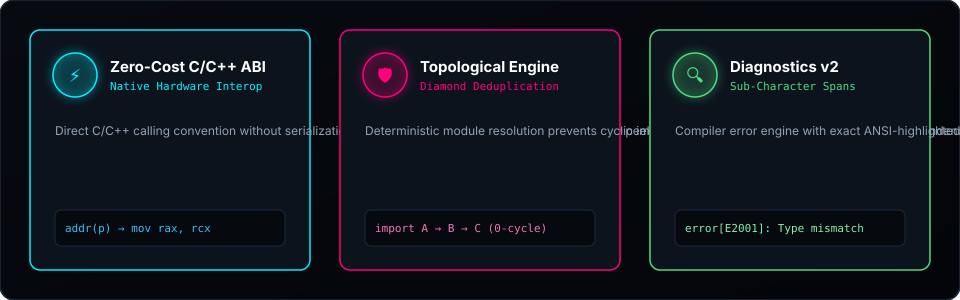
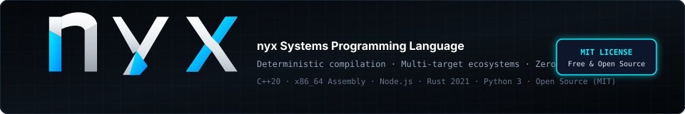

<div align="center">

  <a href="https://github.com/justsomeone-e/nyx">
    
  </a>
  <br/><br/>

  <p align="center">
    <a href="https://readme-typing-svg.demolab.com?font=JetBrains+Mono&weight=700&size=20&duration=3000&pause=1200&color=00F0FF&center=true&vCenter=true&width=700&lines=High-Performance+Multi-Target+Systems+Toolchain.;C%2B%2B20+Native+Binaries+%7C+x86_64+Assembly+%7C+Node.js+%7C+Rust+%7C+Python.;Deterministic+AST+Pipeline+with+Self-Hosting+Stage+1.;Diagnostics+v2+with+Sub-Character+Span+Precision.">
      
    </a>
  </p>

  <p align="center">
    <a href="https://github.com/justsomeone-e/nyx/releases"></a>
    <a href="https://github.com/justsomeone-e/nyx/actions"></a>
    <a href="LICENSE"></a>
    <a href="#"></a>
  </p>

  <p align="center">
    <a href="#overview">OVERVIEW</a> •
    <a href="#key-features">FEATURES</a> •
    <a href="#tech-stack">TECH STACK</a> •
    <a href="#project-structure">STRUCTURE</a> •
    <a href="#installation">INSTALLATION</a> •
    <a href="#usage">USAGE</a> •
    <a href="#contributing">CONTRIBUTING</a> •
    <a href="#license">LICENSE</a>
  </p>

</div>

---

<div align="center">
  
</div>

---

## `01` — Overview

**nyx** is a compiled, statically typed systems programming language and multi-target toolchain designed around a deterministic compiler architecture.

A nyx program is parsed, validated, type-checked, and converted into a canonical typed Abstract Syntax Tree. From that shared representation, nyx can generate code for multiple execution environments without duplicating the language frontend.

<div align="center">
  
</div>

The compiler is intentionally split into frontend, semantic, graph, and backend stages. This keeps language behavior consistent across targets while allowing individual backends to evolve independently.

---

## `02` — Key Features

<div align="center">
  
</div>

### ⚡ Multi-Target Code Generation

nyx can target multiple ecosystems from the same source language:

```text
┌──────────────┬─────────────────────┬──────────────────────────┐
│ Backend      │ Target              │ Output                   │
├──────────────┼─────────────────────┼──────────────────────────┤
│ hecpp        │ C++20               │ Native executable (.exe) │
│ heasm        │ x86_64 Assembly     │ Intel syntax source (.s) │
│ hejs         │ Node.js ES2022      │ ES2022 ESM module (.js)  │
│ hers         │ Rust 2021           │ Rust object pipeline     │
│ hepy         │ Python 3            │ Canonical reference tree │
└──────────────┴─────────────────────┴──────────────────────────┘
```

The frontend remains shared, so target selection happens after parsing and semantic validation.

### ◇ Deterministic AST Pipeline

Nyx uses a deterministic compilation flow:

```text
SOURCE
  │
  ├──► UTF-8 Lexer
  │
  ├──► Syntax Parser
  │
  ├──► Module Graph
  │
  ├──► Type Checker
  │
  ├──► Canonical Typed AST
  │
  └──► Backend Code Generation
```

This structure provides a stable semantic boundary between the language itself and its output targets.

### ◆ Topological Module Resolution

Modules are represented as a dependency graph and processed topologically.

The graph system handles:

* Dependency ordering
* Diamond dependency deduplication
* Dependency cycles
* Ambiguous symbol collisions
* Deterministic graph traversal

```text
        A
       / \
      B   C
       \ /
        D

        ↓

   D is processed once.
   Shared dependencies are deduplicated.
```

### ⌁ Diagnostics v2

Nyx provides source-aware diagnostics with precise spans and stable error identifiers.

```text
error[E1302]: ambiguous symbol collision

  --> src/main.nyx:14:9
   |
14 |     use value
   |         ^^^^^
   |
   = multiple symbols resolve to the same identifier
```

The diagnostic system is designed for both human-readable compiler output and tooling integration.

### ◈ Native C++20 Backend

The `hecpp` backend emits C++20 suitable for compilation through Clang or GCC.

```text
Nyx Source
    │
    ▼
Canonical AST
    │
    ▼
C++20
    │
    ├── Clang
    └── GCC
         │
         ▼
    Native Binary
```

### ⌘ Built-In Language Server

Nyx includes a Language Server Protocol v2 JSON-RPC implementation intended to provide compiler-aware editor tooling.

---

## `03` — Tech Stack

| Component                   | Technology              |
| :-------------------------- | :---------------------- |
| Native target               | **C++20**               |
| JavaScript target           | **Node.js / ES2022**    |
| Rust target                 | **Rust 2021**           |
| Reference target            | **Python 3**            |
| Native compiler             | **LLVM Clang / GCC**    |
| Rust compiler               | **`rustc`**             |
| Protocol                    | **LSP v2 / JSON-RPC**   |
| Source encoding             | **Unicode UTF-8**       |
| Intermediate representation | **Canonical Typed AST** |

Nyx is built around the idea that semantic validation should happen before target-specific code generation. Backends therefore consume the same validated representation instead of independently interpreting source code.

---

## `04` — Project Structure

```text
nyx/
│
├── assets/
│   └── logo.svg
│
├── install.ps1
├── install.sh
│
├── GETTING_STARTED.md
├── INSTALLATION.md
├── LANGUAGE_REFERENCE.md
├── CLI_REFERENCE.md
├── ERROR_REFERENCE.md
├── CHANGELOG.md
│
├── LICENSE
└── README.md
```

The documented tree intentionally contains only repository components established by the project documentation. Undocumented internal compiler directories are not fabricated here.

---

## `05` — Installation

Nyx provides installation scripts for Windows, Linux, and macOS.

### Windows

Run the PowerShell installer:

```powershell
irm https://raw.githubusercontent.com/justsomeone-e/nyx/main/install.ps1 | iex
```

Then verify the environment:

```powershell
nyx doctor
```

### Linux / macOS

Run the POSIX installer:

```bash
curl -fsSL https://raw.githubusercontent.com/justsomeone-e/nyx/main/install.sh | bash
```

Verify the installation:

```bash
nyx doctor
```

### Environment Check

The `doctor` command verifies the host environment and available toolchain components.

```bash
nyx doctor
```

---

## `06` — Usage

### Create a Workspace

```bash
nyx new core_engine
cd core_engine
```

### Check Source

Run semantic and type validation:

```bash
nyx check
```

### Run Native C++20

The default execution backend is `hecpp`:

```bash
nyx run
```

### Run Node.js

```bash
nyx run --target hejs
```

### Run Python Reference

```bash
nyx run --target hepy
```

### Build Rust

```bash
nyx build --target hers
```

---

## `07` — Language Example

A minimal Nyx program can combine typed structures, functions, conditions, imports, and tests:

```nyx
#target hecpp

import "std/math"
import "std/io"

struct ClusterNode {
    address: string,
    port: int,
    is_master: bool
}

fn compute_shard_capacity(nodes: int, factor: int) -> int {
    return power(nodes, 2) * factor
}

var node = ClusterNode("10.0.0.1", 9000, true)

if node.is_master {
    var total_capacity = compute_shard_capacity(8, 4)

    println_str(
        "Cluster Node [" +
        node.address +
        "] Online -> Capacity: " +
        to_string(total_capacity)
    )
}

test "shard capacity verification" {
    assert(
        compute_shard_capacity(2, 3) == 12,
        "Mathematical invariant failure"
    )
}
```

The same frontend representation can then be directed toward another supported backend.

---

## `08` — Verification & Conformance

Nyx maintains an automated verification battery covering lexical analysis, parsing, semantic validation, graph resolution, diagnostics, tooling, fuzzing, and backend behavior.

```text
╔══════════════════════════════════════════════════════════════════════╗
║                    NYX VERIFICATION BATTERY                         ║
╠══════════════════════════════════════════════════════════════════════╣
║                                                                      ║
║  Lexical Analyzer & UTF-8 Stream Suite       ──► 100% PASS          ║
║  Syntactic AST Construction                   ──► 100% PASS          ║
║  Static Type Invariant Checks                 ──► 100% PASS          ║
║  Topological Graph Deduplication              ──► 100% PASS          ║
║  Ambiguous Symbol Collision E1302            ──► 100% PASS          ║
║  LSP v2 RPC                                   ──► 100% PASS (3/3)   ║
║  Clean Sandbox Isolation                      ──► 100% PASS (5/5)   ║
║  Negative Syntax / Semantic Rejections        ──► 100% PASS (10/10) ║
║  Deterministic Fuzz Engine                    ──► 100% PASS (530/530)║
║  Differential Backend Parity                  ──► 100% PASS (10/10) ║
║  Node.js ES2022 End-to-End                    ──► 100% PASS (8/8)   ║
║  Rust 2021 Borrow-Check                       ──► 100% PASS (8/8)   ║
║  C++20 Native Machine Code                    ──► 100% PASS (8/8)   ║
║  Edge-Case Regression                         ──► 100% PASS (138/138)║
║                                                                      ║
╚══════════════════════════════════════════════════════════════════════╝
```

### Conformance Matrix

| Pipeline    | Target         | Quality Gate | Status                 |
| :---------- | :------------- | :----------: | :--------------------- |
| **`hecpp`** | C++20          |  **Gate 8**  | 🔒 Frozen / Production |
| **`hejs`**  | Node.js ES2022 |  **Gate 8**  | 🔒 Frozen / Production |
| **`hepy`**  | Python 3       |  **Gate 8**  | 📐 Reference Semantics |
| **`hers`**  | Rust 2021      |  **Gate 6**  | 🟡 Conformance Probe   |

---

## `09` — Diagnostics

Nyx diagnostics are built around structured error codes and precise source spans.

```text
┌─────────────────────────────────────────────────────┐
│ error[E1302]: ambiguous symbol collision             │
├─────────────────────────────────────────────────────┤
│                                                     │
│  --> src/main.nyx:14:9                              │
│                                                     │
│ 14 │ use value                                      │
│    │     ^^^^^                                      │
│                                                     │
│ = multiple symbols resolve to the same identifier   │
└─────────────────────────────────────────────────────┘
```

The documented error catalog currently covers the `E1000` through `E2006` range.

See [`ERROR_REFERENCE.md`](ERROR_REFERENCE.md) for the diagnostic catalog.

---

## `10` — Documentation

| Documentation                                    | Description                       |
| :----------------------------------------------- | :-------------------------------- |
| [`GETTING_STARTED.md`](GETTING_STARTED.md)       | Architecture and initial workflow |
| [`INSTALLATION.md`](INSTALLATION.md)             | Installation and toolchain setup  |
| [`LANGUAGE_REFERENCE.md`](LANGUAGE_REFERENCE.md) | Language reference and grammar    |
| [`CLI_REFERENCE.md`](CLI_REFERENCE.md)           | CLI and command reference         |
| [`ERROR_REFERENCE.md`](ERROR_REFERENCE.md)       | Diagnostic error catalog          |
| [`CHANGELOG.md`](CHANGELOG.md)                   | Release history                   |

---

## `11` — Contributing

Nyx welcomes contributions that improve the compiler, language, tooling, documentation, and verification infrastructure.

Before opening a pull request:

1. Keep changes focused and reviewable.
2. Preserve deterministic compiler behavior.
3. Add regression coverage for behavior changes.
4. Verify affected compilation targets.
5. Keep diagnostics precise and consistent.
6. Update documentation for user-facing changes.
7. Avoid unnecessary dependencies or unrelated refactoring.

For larger architectural changes, discuss the intended design before implementing a substantial change.

### Pull Request Checklist

```text
[ ] Implementation is focused
[ ] Existing behavior is preserved where intended
[ ] Relevant verification suites pass
[ ] Affected backends were checked
[ ] Diagnostics remain deterministic
[ ] Documentation was updated
[ ] No unnecessary dependencies were introduced
```

---

## `12` — License

nyx is licensed under the **MIT License**.

See [`LICENSE`](LICENSE) for the complete license text.

---

<div align="center">
  
</div>
