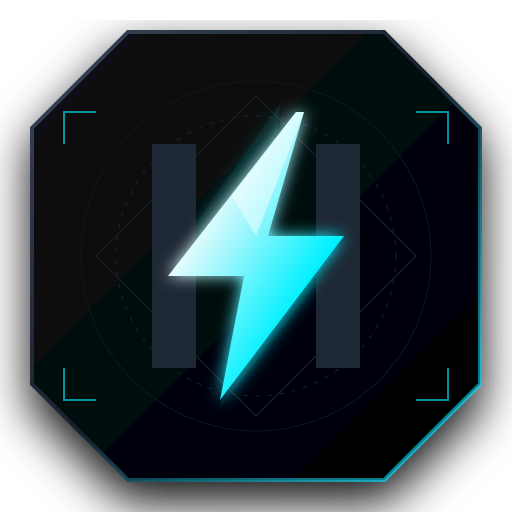

<div align="center">

  <a href="https://github.com/justsomeone-e/Nyx">
    
  </a>
  <br/><br/>

  <a href="https://github.com/justsomeone-e/Nyx">
    
  </a>

  <p align="center">
    <a href="https://readme-typing-svg.demolab.com?font=JetBrains+Mono&weight=700&size=20&duration=3000&pause=1200&color=00F0FF&center=true&vCenter=true&width=700&lines=High-Performance+Multi-Target+Systems+Toolchain.;C%2B%2B20+Native+Binaries+%7C+Node.js+ES2022+%7C+Rust+2021+%7C+Python+3.;Deterministic+AST+Pipeline+with+Topological+Deduplication.;Diagnostics+v2+with+Sub-Character+Span+Precision.">
      
    </a>
  </p>

  <p align="center">
    <a href="https://github.com/justsomeone-e/Nyx/releases"></a>
    <a href="https://github.com/justsomeone-e/Nyx/actions"></a>
    <a href="LICENSE"></a>
    <a href="#"></a>
  </p>

  <p align="center">
    <a href="#-overview">OVERVIEW</a> •
    <a href="#-architecture">ARCHITECTURE</a> •
    <a href="#-toolchain-installation">INSTALLATION</a> •
    <a href="#-language-specification">SYNTAX SPEC</a> •
    <a href="#-conformance-matrix">CONFORMANCE</a> •
    <a href="#-documentation">DOCS</a>
  </p>

</div>

---

### § 1.0 OVERVIEW

**Nyx** is a compiled, statically typed systems programming language engineered for cross-compilation agility and deterministic execution. It eliminates runtime overhead by emitting optimized native C++20 machine code, Node.js ES2022 modules, Rust 2021 crates, and Python 3 canonical models directly from a single validated Abstract Syntax Tree.

```text
  [::] Deterministic Frontend  ──>  Lexer (Unicode UTF-8) ──> Canonical Typed AST
  [::] Multi-Target Codegen    ──>  C++20 (LLVM/GCC) | Node.js | Rust 2021 | Python 3
  [::] Module Topography       ──>  Directed Acyclic Graph with Diamond Deduplication
  [::] Error Subsystem         ──>  Diagnostics v2 (Span Carets ^^^^, Code Catalogs)
  [::] Developer Protocol      ──>  Language Server Protocol v2 JSON-RPC Built-in
```

---

### § 2.0 COMPILER ARCHITECTURE

```text
                                +─────────────────────────────────+
                                |      Nyx Source (.nyx / .he)     |
                                +────────────────┬────────────────+
                                                 │
                                       ┌─────────▼─────────┐
                                       │   Lexical Engine  │  [Token Streams, Unicode]
                                       └─────────┬─────────┘
                                                 │
                                       ┌─────────▼─────────┐
                                       │   Syntactic AST   │  [Parser Combinator]
                                       └─────────┬─────────┘
                                                 │
                                   ┌─────────────▼─────────────┐
                                   │  Topological Graph Loader │  [Diamond Deduplication,
                                   └─────────────┬─────────────┘   Cycle E1300, Collision E1302]
                                                 │
                                       ┌─────────▼─────────┐
                                       │    TypeChecker    │  [Inference, Scopes, Bounds]
                                       └─────────┬─────────┘
                                                 │
                                       ┌─────────▼─────────┐
                                       │  Canonical AST    │
                                       └─────────┬─────────┘
                                                 │
          ┌───────────────────────┬──────────────┴──────────────┬───────────────────────┐
          │                       │                             │                       │
    ┌─────▼─────┐           ┌─────▼─────┐                 ┌─────▼─────┐           ┌─────▼─────┐
    │   hecpp   │           │   hejs    │                 │   hers    │           │   hepy    │
    │  Gate 8 🔒│           │  Gate 8 🔒│                 │  Gate 6 🟡│           │  Gate 8 📐│
    │   C++20   │           │  Node.js  │                 │ Rust 2021 │           │ Reference │
    └─────┬─────┘           └─────┬─────┘                 └─────┬─────┘           └─────┬─────┘
          │                       │                             │                       │
          ▼                       ▼                             ▼                       ▼
     Native .exe             ES2022 Module                 rustc Object              Python 3
    (Clang / GCC)
```

---

### § 3.0 TOOLCHAIN INSTALLATION

#### Automated Deployment

<table>
  <tr>
    <th>Host Architecture</th>
    <th>Installation Command</th>
  </tr>
  <tr>
    <td><b>Windows (PowerShell)</b></td>
    <td><code>irm https://raw.githubusercontent.com/justsomeone-e/Nyx/main/install.ps1 | iex</code></td>
  </tr>
  <tr>
    <td><b>Linux / macOS (POSIX)</b></td>
    <td><code>curl -fsSL https://raw.githubusercontent.com/justsomeone-e/Nyx/main/install.sh | bash</code></td>
  </tr>
</table>

#### Command Matrix

```bash
# Verify host compilers, environment paths & tooling
nyx doctor

# Initialize a clean workspace
nyx new core_engine
cd core_engine

# High-speed semantic and type verification
nyx check

# Compile and execute target binary (Default: C++20 Native)
nyx run

# Direct backend compilation
nyx run --target hejs     # High-throughput Node.js ES2022
nyx run --target hepy     # Canonical semantic reference
nyx build --target hers   # Rust 2021 object emit
```

---

### § 4.0 LANGUAGE SPECIFICATION

```nyx
#target hecpp
import "std/math"
import "std/io"

// Typed Memory Struct Definition
struct ClusterNode {
    address: string,
    port: int,
    is_master: bool
}

// Pure Functional Logic with Strict Type Annotations
fn compute_shard_capacity(nodes: int, factor: int) -> int {
    return power(nodes, 2) * factor
}

// Entrypoint Execution Logic
var node = ClusterNode("10.0.0.1", 9000, true)
if node.is_master {
    var total_capacity = compute_shard_capacity(8, 4)
    println_str("Cluster Node [" + node.address + "] Online -> Capacity: " + to_string(total_capacity))
}

// In-File Verification Battery
test "shard capacity verification" {
    assert(compute_shard_capacity(2, 3) == 12, "Mathematical invariant failure")
}
```

---

### § 5.0 QUALITY GATES & CONFORMANCE MATRIX

| Pipeline | Target | Quality Gate | Conformance Level | Compiler Driver |
| :--- | :--- | :--- | :--- | :--- |
| **`hecpp`** | C++20 | **Gate 8 (Stable)** | 🔒 Frozen / Production | LLVM Clang / GCC (Native Executable) |
| **`hepy`** | Python 3 | **Gate 8 (Reference)**| 📐 Reference Semantics | Python 3.10+ Canonical Runner |
| **`hejs`** | JS/Node | **Gate 8 (Stable)** | 🔒 Frozen / Production | Node.js ES2022 Module Engine |
| **`hers`** | Rust | **Gate 6 (Active)** | 🟡 Conformance Probe | `rustc` 2021 MIR / Borrow-Check |

---

### § 6.0 VERIFICATION BATTERY STATUS

```text
================================================================================
◈ NYX CORE AUTOMATED VERIFICATION MATRIX
================================================================================
[-] Lexical Analyzer & UTF-8 Stream Suite     ──> 100% PASS
[-] Syntactic AST Construction Battery         ──> 100% PASS
[-] Static Type Invariant Checks               ──> 100% PASS
[-] Topological Graph Deduplication (Diamond)  ──> 100% PASS (0 duplicate nodes)
[-] Ambiguous Symbol Collision (E1302)         ──> 100% PASS
[-] Language Server Protocol (LSP v2 RPC)      ──> 100% PASS (3/3)
[-] Clean Sandbox Isolation Smoke Battery      ──> 100% PASS (5/5)
[-] Negative Syntax & Semantic Rejections      ──> 100% PASS (10/10)
[-] Deterministic Fuzz Engine (Seed=42)        ──> 100% PASS (530/530, 0 Crash)
[-] Differential Backend Parity Suite          ──> 100% PASS (10/10, 100% Parity)
[-] Node.js ES2022 End-to-End Conformance      ──> 100% PASS (8/8)
[-] Rust 2021 Borrow-Check Conformance         ──> 100% PASS (8/8)
[-] C++20 Native Machine Code Conformance      ──> 100% PASS (8/8)
[-] 138-Point Edge-Case Regression Battery     ──> 100% PASS (138/138)
================================================================================
[OK] ALL SUITES CONVERGED WITH ZERO REGRESSIONS (100% SUCCESS RATE)
================================================================================
```

---

### § 7.0 TECHNICAL DOCUMENTATION

* ◈ [Architecture & Toolchain Guide](GETTING_STARTED.md)
* ◈ [Installation & Toolchain Setup](INSTALLATION.md)
* ◈ [Language Reference & Grammar Specification](LANGUAGE_REFERENCE.md)
* ◈ [CLI Diagnostics & Command Reference](CLI_REFERENCE.md)
* ◈ [Diagnostic Error Catalog (E1000 - E2006)](ERROR_REFERENCE.md)
* ◈ [Release Changelog](CHANGELOG.md)

---

<div align="center">
  <sub>Maintained by Nyx Systems Core. Licensed under <a href="LICENSE">MIT</a>.</sub>
</div>
